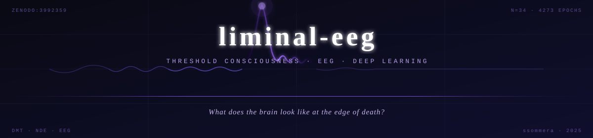
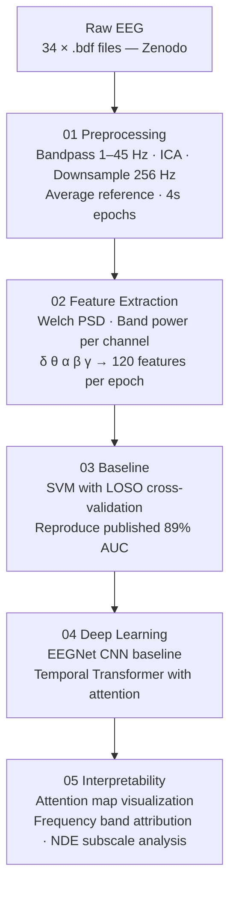

<p align="center">
  
</p>

<p align="center">
  
  
  
  
  
  
</p>

---

<p align="center">
  <em>What does the brain look like at the edge of death?</em>
</p>

---

## Overview

**liminal-eeg** is a deep learning research pipeline for **predicting near-death experience (NDE) intensity from EEG recorded during psychedelic states**. Using 34-subject EEG data collected during DMT administration, the pipeline classifies and regresses NDE phenomenology scores directly from neural signals — with no labels used during signal acquisition.

The project sits at the intersection of **computational neuroscience**, **consciousness research**, and **deep learning**, building toward interpretable models that reveal which neural signatures correlate with threshold conscious experiences.

This is independent research conducted outside of any coursework or institutional affiliation.

---

## Research Question

> *Can a deep learning model predict the intensity of a near-death experience from EEG recorded during a DMT-induced altered state — and do the learned representations reveal interpretable neural signatures?*

### Why It Matters

Near-death experiences are among the most profound and least understood phenomena in human consciousness. Clinical studies of dying patients have identified gamma-band neural surges in the moments before death — but what distinguishes a profound NDE from a mild one remains unknown at the neural level. This project asks whether that difference is legible in the EEG signal, and whether attention mechanisms can reveal *where* in the frequency spectrum it lives.

Practically, this work contributes toward:

- **Neural correlates of consciousness** at altered and boundary states
- **Interpretable EEG deep learning** with attention visualization
- **Psychedelic neuroscience** — connecting DMT phenomenology to measurable brain dynamics
- **Clinical foundations** for studying perimortem neural activity

---

## Dataset

**Zenodo: Neural and subjective effects of inhaled DMT in natural settings**
DOI: [10.5281/zenodo.3992359](https://doi.org/10.5281/zenodo.3992359)

| Property | Details |
|---|---|
| **Subjects** | 34 (S01–S35, S21 excluded — format mismatch) |
| **Channels** | 24-channel EEG |
| **Condition** | Resting-state EEG during peak DMT experience |
| **Sample Rate** | 500 Hz (downsampled to 256 Hz) |
| **Labels** | NDE-Total score + 4 subscales (Greyson NDE Scale) |
| **Epochs** | 4,273 total · 4-second windows |
| **Features** | 120 (24 channels × 5 frequency bands) |
| **Source** | Alamia et al. (2020) |

---

## Pipeline Architecture



---

## Methods

| Stage | Technique | Rationale |
|---|---|---|
| **Artifact Removal** | ICA (15 components) | Separates neural signal from muscular and movement noise |
| **Feature Extraction** | Welch PSD band power (δ, θ, α, β, γ) | Captures frequency-domain dynamics across all channels |
| **Baseline** | SVM · RBF kernel · LOSO-CV | Reproduces Alamia et al. published result for validation |
| **Model 1** | EEGNet (CNN) | Lightweight, well-cited EEG deep learning baseline |
| **Model 2** | Temporal Transformer | Novel contribution — attention over time and frequency |
| **Evaluation** | Leave-One-Subject-Out CV | Ensures no subject data leaks between train and test |
| **Interpretability** | Attention weight visualization | Maps which neural signatures drive NDE score prediction |

---

## Published Baseline

> Alamia et al. (2022) achieved **89% AUC** using SVM on complex network measures derived from EEG connectivity matrices — binary classification of baseline vs. DMT brain state.

This project extends that work by:

1. Predicting **continuous NDE intensity** (regression), not just altered vs. baseline (classification)
2. Using **deep learning** with temporal attention rather than handcrafted connectivity features
3. Connecting predictions to **NDE subscales** (cognitive, affective, paranormal, transcendence)

---

## Repo Structure

```
liminal-eeg/
├── assets/
│   └── banner.svg
├── data/
│   ├── raw/                        # BDF files (gitignored)
│   └── processed/                  # Feature matrices, label files
├── notebooks/
│   ├── 01_preprocessing.ipynb
│   ├── 02_baseline_svm.ipynb
│   ├── 03_eegnet.ipynb
│   ├── 04_transformer.ipynb
│   └── 05_interpretability.ipynb
├── src/
│   ├── preprocessing.py            # MNE pipeline — BDF → band power features
│   ├── baseline.py                 # SVM LOSO-CV baseline
│   ├── eegnet.py                   # EEGNet CNN implementation
│   ├── transformer.py              # Temporal Transformer
│   └── interpret.py                # Attention visualization
├── results/
│   ├── figures/
│   └── reports/
├── nde_labels.csv                  # Greyson NDE scores per subject
├── requirements.txt
├── .gitignore
└── README.md
```

---

## Project Status

| Component | Status |
|---|---|
| Repo scaffold + architecture | ✅ Complete |
| MNE preprocessing pipeline | ✅ Complete |
| Feature matrix (4273 × 120) | ✅ Complete |
| NDE label extraction | ✅ Complete |
| SVM baseline (LOSO-CV) | 🔄 In progress |
| EEGNet CNN | 📋 Planned |
| Temporal Transformer | 📋 Planned |
| Attention visualization | 📋 Planned |
| Results write-up | 📋 Planned |

---

## Installation

```bash
git clone https://github.com/ssommera/liminal-eeg.git
cd liminal-eeg
pip install -r requirements.txt
```

### Requirements

```
mne>=1.6.0
torch>=2.2.0
scikit-learn>=1.4.0
numpy>=1.26.0
pandas>=2.2.0
matplotlib>=3.8.0
scipy>=1.12.0
jupyterlab>=4.0.0
```

---

## Related Work

- Alamia et al. (2020) — Neural and subjective effects of inhaled DMT in natural settings
- Alamia et al. (2022) — A machine learning approach to study altered states of consciousness
- Borjigin et al. (2023) — Surge of neurophysiological activity at the hour of death
- Greyson (1983) — The NDE Scale: Construction, reliability, and validity
- Lawhern et al. (2018) — EEGNet: A compact CNN for EEG-based BCIs

---

## Connection to Broader Research

**liminal-eeg** is part of a growing independent research portfolio at the intersection of AI and human biology:

**[cortex-unsupervised](https://github.com/ssommera/cortex-unsupervised)** — Label-free neural state discovery from EEG using unsupervised ML. Explores the geometry of brain state space without clinical annotation.

**[The Bill Coleman Project](https://github.com/ssommera/Bill_Coleman_Project)** — AI-powered early detection of small cell lung cancer and immunotherapy-induced pulmonary toxicity prediction.

Together, these projects share a single thread:

> *The moments that matter most — at the boundary of life — are where AI has the most left to offer.*

---

## License

MIT License. EEG data sourced from Zenodo under Creative Commons open access. NDE Scale (Greyson, 1983) used for research purposes only.

*This is an independent research project and is not affiliated with Georgia Institute of Technology or any coursework.*

---

<p align="center">
  <em>Mapping the threshold — one epoch at a time.</em>
</p>
